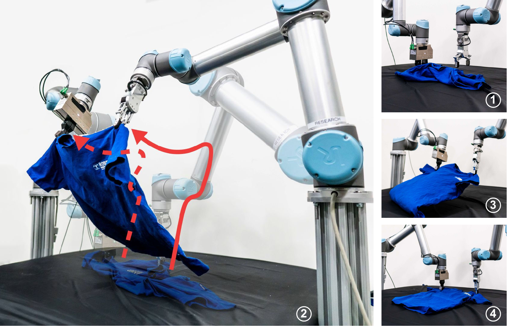
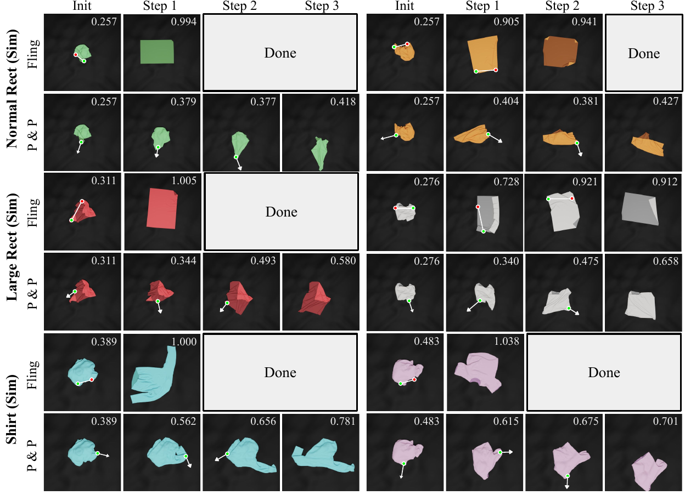
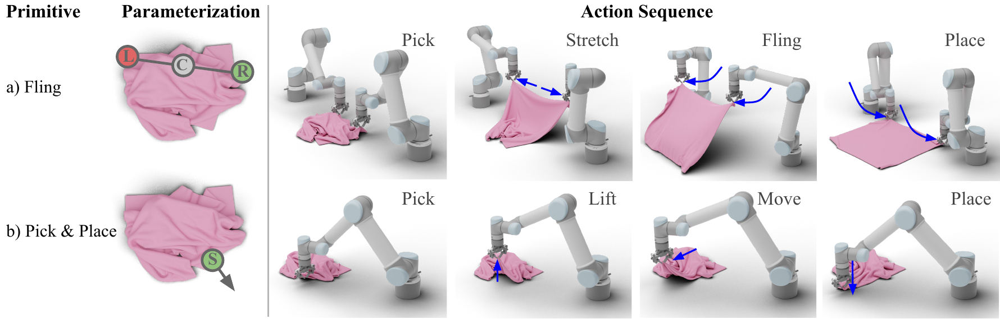
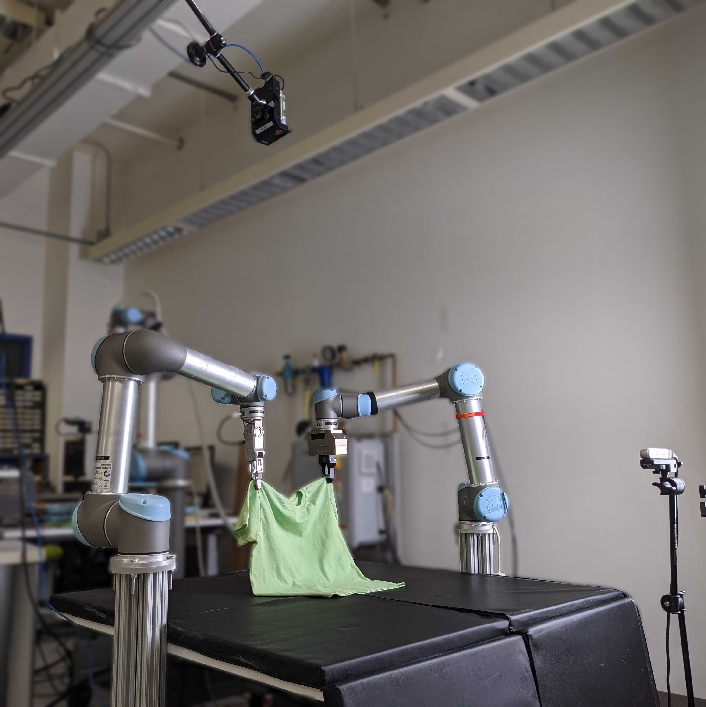

<h1> FlingBot: The Unreasonable Effectiveness of Dynamic Manipulations for Cloth Unfolding</h1>
<div style="text-align: center;">

[Huy Ha](https://www.cs.columbia.edu/~huy/),  [Shuran Song](https://www.cs.columbia.edu/~shurans/)

Columbia University, New York, NY, United States

[Conference on Robot Learning 2021](https://www.robot-learning.org/) (Oral Presentation)

[Project Page](https://flingbot.cs.columbia.edu/) | [Video](https://www.youtube.com/watch?v=T4tDy5y_6ZM&ab_channel=ColumbiaArtificialIntelligenceandRobotics) | [Arxiv](https://arxiv.org/abs/2105.03655)

</div>



<div style="margin:50px; text-align: justify;">
High-velocity dynamic actions (e.g., fling or throw) play a crucial role in our everyday interaction with deformable objects by improving our efficiency and effectively expanding our physical reach range.
Yet, most prior works have tackled cloth manipulation using exclusively single-arm quasi-static actions, which requires a large number of interactions for challenging initial cloth configurations and strictly limits the maximum cloth size by the robot's reach range.
In this work, we demonstrate the effectiveness of dynamic flinging actions for cloth unfolding with our proposed self-supervised learning framework, FlingBot.
Our approach learns how to unfold a piece of fabric from arbitrary initial configurations using a pick, stretch, and fling primitive for a dual-arm setup from visual observations.
The final system achieves over 80% coverage within 3 actions on novel cloths,  can unfold cloths larger than the system's reach range, and generalizes to T-shirts despite being trained on only rectangular cloths.
We also finetuned FlingBot on a real-world dual-arm robot platform, where it increased the cloth coverage over 4 times more than the quasi-static baseline did.
The simplicity of FlingBot combined with its superior performance over quasi-static baselines demonstrates the effectiveness of dynamic actions for deformable object manipulation.
</div>

<br>

This repository contains code for training and evaluating [FlingBot](https://flingbot.cs.columbia.edu/) in both simulation and real-world settings on a dual-UR5 robot arm setup for Ubuntu 18.04.
It has been tested on machines with Nvidia GeForce 1080 Ti and GeForce RTX 2080 Ti.


If you find this codebase useful, consider citing:


<div style="display:flex;">
<div>

```
@inproceedings{ha2021flingbot,
	title={FlingBot: The Unreasonable Effectiveness of Dynamic Manipulation for Cloth Unfolding},
	author={Ha, Huy and Song, Shuran},
	booktitle={Conference on Robotic Learning (CoRL)},
	year={2021}
}
```

</div>

</div>

If you have any questions, please contact [me](https://www.cs.columbia.edu/~huy/) at `huy [at] cs [dot] columbia [dot] edu`.


# Table of Contents
- 1 [Simulation](#simulation)
  - 1.1 [Setup](#setup)
  - 1.2 [Evaluate FlingBot](#evaluate-flingbot)
  - 1.3 [Train FlingBot](#train-flingbot)
  - 1.4 [Generating new tasks](#generating-new-tasks)
- 2 [Real World](#real-world)
  - 2.1 [Real world setup](#real-world-setup)
  - 2.2 [Running Flingbot in the real world](#running-real-world-flingbot)

# Simulation
## Setup

This section walks you through setting up the CUDA accelerated cloth simulation environment.
To start, install [Blender](https://www.blender.org/download/), [docker](https://docs.docker.com/engine/install/ubuntu/) and [nvidia-docker](https://github.com/NVIDIA/nvidia-docker#quickstart).

### Python Dependencies

We have prepared a conda YAML file which contains all the python dependencies.

```
conda env create -f flingbot.yml
```

### Compiling the simulator

This codebases uses a CUDA accelerated cloth simulator which can load any arbitrary mesh to train a cloth unfolding policy.
The simulator is a fork of [PyFlex](https://github.com/YunzhuLi/PyFleX) from [Softgym](https://github.com/Xingyu-Lin/softgym), and requires a GPU to run.
We have provided a Dockerfile in this repo for compiling and using this simulation environment for training in Docker.

```
docker build -t flingbot .
```

To launch the docker container, go to this repo's root directory, then run
```
export FLINGBOT_PATH=${PWD}
nvidia-docker run \
	-v $FLINGBOT_PATH:/workspace/flingbot\
	-v /path/to/your/anaconda3:/path/to/your/anaconda3\
	--gpus all --shm-size=64gb  -d -e DISPLAY=$DISPLAY -e QT_X11_NO_MITSHM=1 -it flingbot
```
You might need to change `--shm-size` appropriately for your system.

Add conda to PATH, then activate flingbot
```sh
export PATH=/path/to/your/anaconda3/bin:$PATH
conda init bash
source ~/.bashrc
conda activate flingbot
``` 
Then, at the root of this repo inside the docker container, compile the simulator with 
```
. ./prepare.sh && ./compile.sh
```
*NOTE: Always make sure you're in the correct conda environment before running these two shell scripts*.

The compilation will result in a `.so` shared object file. 
`./prepare.sh` sets the environment variables needed for compilation and also tells the python interpreter to look into the build directory containing the compiled `.so` file.

After this `.so` object file is created, you should be able to run experiments outside of docker as well as inside.
In my experience as well as [other's in the community](https://github.com/Xingyu-Lin/softgym/issues/5), docker is best used *only for compilation* and usually fails for running experiments.
If you experience this, try taking the compiled `.so` file and running the python commands in the sections to follow *outside of docker*.
Make sure you set the environment variables correctly using `./prepare.sh`.
Not setting `$PYTHONPATH` correctly will result in `ModuleNotFoundError: No module named 'pyflex'` when you try to `import pyflex`.

You can check out [Softgym's Docker guide](https://github.com/Xingyu-Lin/softgym/blob/master/docker/docker.md) and [Daniel Seita](https://danieltakeshi.github.io/)'s [blog post](https://danieltakeshi.github.io/2021/02/20/softgym/) on installing PyFlex with Docker for more information.

## Evaluate FlingBot

In the repo's root, download the pretrained weights
```sh
wget https://flingbot.cs.columbia.edu/data/flingbot.pth
```
As described in the paper, we evaluate FlingBot on 3 held-out different evaluation datasets.
First are normal cloths, which contain rectangular cloths from the same distribution as the training dataset.
Second are large cloths, which also rectangular cloths like normal cloths, but larger than the system's reach range.
Third are shirts, which are completely unseen during training.



To download the evaluation datasets
```sh
wget https://flingbot.cs.columbia.edu/data/flingbot-normal-rect-eval.hdf5
wget https://flingbot.cs.columbia.edu/data/flingbot-large-rect-eval.hdf5
wget https://flingbot.cs.columbia.edu/data/flingbot-shirt-eval.hdf5
```
To evaluate FlingBot on one of the evaluation datasets, pass their respective paths

```sh
python run_sim.py --eval --tasks flingbot-normal-rect-eval.hdf5 --load flingbot.pth --num_processes 1 --gui
```
You can remove `--gui` to run headless, and use more parallel environments with `--num_processes 16`.
Since the simulator is hardware accelerated, the maximum `--num_processes` you can set will be limited by how much memory your GPU have.
You can also add `--dump_visualizations` to get videos of the episodes.

The output of evaluation is a directory whose name is prefixed with the checkpoint name (i.e.: `flingbot_eval_X` in the the example), which contains a `replay_buffer.hdf5`.
You can print the summary statistics and dump visualizations
```
python visualize.py flingbot_eval_X/replay_buffer.hdf5
cd flingbot_eval_X
python -m http.server 8080
```
The last command starts a webserver rooted at `flingbot_eval_X` so you can view the visualizations on your web browser at `localhost:8080`.

## Train Flingbot

In the repo's root, download the training tasks

```sh
wget https://flingbot.cs.columbia.edu/data/flingbot-rect-train.hdf5
```
Then train the model from scratch with
```sh
python run_sim.py --tasks_path flingbot-rect-train.hdf5 --num_processes 16 --log flingbot-train-from-scratch --action_primitives fling
```
Make sure to change `num_processes` appropriately for your GPU memory capacity.
You can also change `action_primitive` to any subset of `['fling', 'stretchdrag', 'drag', 'place']`. 

For instance, to train an unfolding policy which uses `fling` and `drag` at the same time, use `--action_primitive fling drag`.

### Cloth renderer

In our paper, we use Blender to render cloths with domain randomization to help with sim2real transfer.
However, training with Blender is much slower due to the over head of launching a rull rendering engine as a subprocess.

We also provide the option of rendering with opengl within PyFlex with `--render_engine opengl`.
We recommend using this option if domain randomization is not necessary.

*Note: that the results reported in our paper were with `--render_engine blender`.*

We prefer using the Eevee engine over Cycles in Blender, since we require faster training time but do not need ray-traced images.
However, because Eevee does not support headless rendering, you will need a virtual desktop environment if you plan to run the codebase on a headless server.

## Generating new tasks

You can also generate new cloth unfolding task datasets.
To generate a normal rect dataset
```sh
python environment/tasks.py --path new-normal-rect-tasks.hdf5 --num_processes 16 --num_tasks 200 --cloth_type square --min_cloth_size 64 --max_cloth_size 104
```
where min and max cloth size is measured in number of particles.
Since the default particle radius is `0.00625m`, `64-104` particles per edge gives a `0.4m-0.65m` edge length.
Similarly, to generate a large rect dataset
```sh
python environment/tasks.py --path new-large-rect-tasks.hdf5 --num_processes 16 --num_tasks 200 --cloth_type square --min_cloth_size 64 --max_cloth_size 120 --strict_min_edge_length 112
```
where a `strict_min_edge_length` of 112 ensures that at least one edge is greater than the system's physical reach range `112 * 0.00625m = 0.7m`.
This physical limit is imposed with a max lift height and max stretch distance.
To regenerate an unfolding task dataset with shirts similar to ours, download our version of Cloth3D, where all jackets have been filtered out and all meshes have been appropriately processed
```sh
wget  https://flingbot.cs.columbia.edu/data/cloth3d.tar.gz
tar xvzf cloth3d.tar.gz
```
Then run the following command
```sh
python environment/tasks.py --path new-shirt-tasks.hdf5.hdf5 --num_processes 16 --num_tasks 200 --cloth_type mesh --cloth_mesh_path cloth3d/val
```

You can replace `--cloth_mesh_path` with any directory containing *only quad meshes*.
To achieve the best simulation quality, make sure edge lengths in the meshes are roughly the particle radius (`0.00625m` by default).

# Real World

Our real world system uses 2 UR5 (CM3) arms, one equipped with an OnRobot RG2 gripper and one with a Schunk WSG50.
We modify the Schunk WSG50 finger tip with a rubber tip for better cloth pinch grasping.
We use 2 RGB-D cameras, an Azure Kinect v3 for the top down camera and an Intel Realsense D415.

You can setup the IP addresses of the robots and cameras inside `real_world/setup.py`

## Real world setup 
### Cloth dataset

The real world testing cloth dataset is stored in a dictionary called `cloths` at the top of `real_world/realWorldEnv.py`.
To use your own cloths, add a dictionary item to `cloths` which contains `flattened_area` (as measured with `compute_coverage()`), `cloth_size` and `mass`.
One entry has been left in there as an example.
In each experiment, you can select the cloth you're currently using with `CURRENT_CLOTH`.

### Workspace background segmentation 

In FlingBot, we use domain randomization on the background texture in Blender to help with sim2real transfer.
However, a simpler solution is to train a simulation model to work on only black backgrounds, then filter out the background in real.
Since object-background segmentation is a solved problem, this hack feels acceptable in the context of getting high speed flinging to work.
To use this, you can set `replace_background=True` in `RealWorldEnv`'s constructor.
This allows a simulation model trained with an OpenGL rendering engine (such that background domain randomization is absent) to also be transferred to real.
Note that for the results we report in the paper, we use `replace_background=False.` and Blender as our rendering engine.


### Stretching primitive variables

To mitigate the use of expensive and inaccessible force sensors, we choose to implement our stretching primitive using vision only.
The stretching primitive and variables are defined in `real_world/stretch.py`.
The closed-loop procedure takes an RGB-D image at every iteration, determines whether the cloth has been stretched, then halting if it has and continues to stretch otherwise.
The stretching detector is implemented by finding the horizontal line at the top of the cloth mask then checking if it is straight.

You can set the 3 stretching variables as follows:
 - `FOREGROUND_BACKGROUND_DIST`: the depth distance from the front camera such that both arms and the cloth are closer than this distance after a grasp.
 - `GRIPPER_LINE`: The y (vertical) coordinate in the front camera image where the middle of the gripper is after a grasp.
 - `CLOTH_LINE`: The y (vertical) coordinate in the front camera image where the cloth is (just below the tips of the gripper) after a grasp.
While setting up the stretching variables, you should set `debug=True` in `is_cloth_stretched()`.

This stretching primitive assumes the front camera is approximately `0.8m` away from the center of the arms, with a front view of the arms.
Make sure the front camera is always centered as so. 
If the distance of the front camera from the two arms is different, you can set  `FOREGROUND_BACKGROUND_DIST` accordingly.

## Running Flingbot in the real world

### Camera calibration

FlingBot policies actions encoded as a pixel.
To find and grasp the 3D position in the real world setup of a chosen pixel in the RGB-D image, the camera pose relative to the arms' bases can be calibrated with
```sh
python calibrate_camera.py
```
The output of this script are a depth scaling and the relative poses of the camera to the right arm and left arm, saved as `camera_depth_scale.txt`,  `top_down_left_ur5_cam_pose.txt`,  and `top_down_right_ur5_cam_pose.txt` respectively.

I recommend rerunning this script everytime you run real world experiments.

### Loading a simulation trained model

To load a simulation model whose path is at `./flingbot.pth` and run the real world setup,
```sh
python run_real_world.py --load flingbot.pth --warmup 128 --log logs/flingbot-real-world
```
where `--warmup` specifies the number of real world data points to collect before the model begins finetuning.
Like all simulation commands, you'll need to run `. ./prepare.sh` before real world commands.